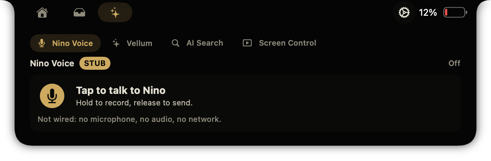
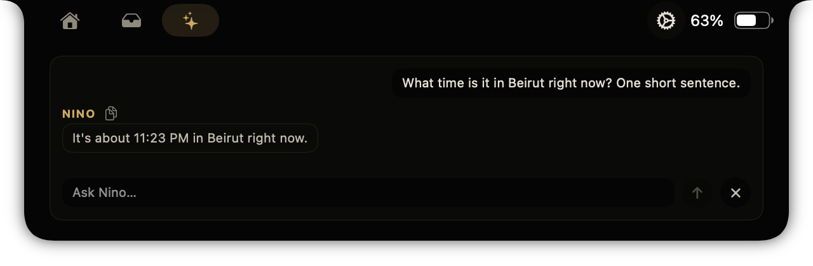
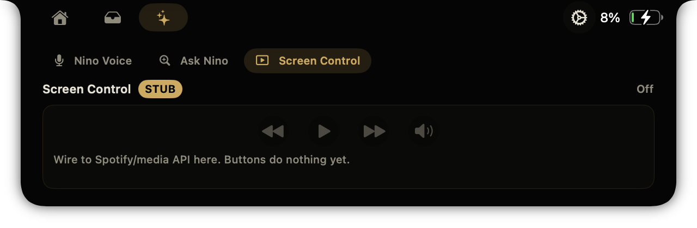

# Nino Notch

**Nino Notch** is a Nino-branded macOS notch shell. Nino is *The AI that runs your growth.*

It is the **one** app in the MacBook notch. Upstream features (music control, HUD replacement, shelf, calendar, camera) work as-is. On top, a **Nino** tab hosts plug-in modules through one protocol:

- **Nino Voice** (live): talk anywhere, transcribed on this Mac, pasted where you type. The engine is Nino Voice (`~/dev/VoiceInk`), running headless; this tab and a small closed-notch indicator are its only screen.
- **Ask Nino** (live): Right Command from any app, answered by OpenClaw with hands on this Mac.
- **Screen Control** (live): say or type "open Spotify and play my Liked Songs"; Jev decides fast (when a TypeSafe key is set), Claude CLI takes the rest, and the Mac does it.

How the two apps fit together: [docs/ARCHITECTURE.md](docs/ARCHITECTURE.md).

## License and credit (required)

This project is a fork of **[Boring Notch](https://github.com/TheBoredTeam/boring.notch)** by [TheBoredTeam](https://github.com/TheBoredTeam).

Upstream license: **GNU GPLv3**. `LICENSE` and `THIRD_PARTY_LICENSES` are unchanged. This fork does not relicense the work. If you ship a build you must keep GPLv3, keep the attribution, and share source.

## What this fork adds

- Nino name, bundle id `com.meetnino.notch`, gold-on-black palette, placeholder icon
- `NinoModule` protocol + registry + a switcher in the notch's Nino tab
- Live Nino Voice, Ask Nino and Screen Control modules

To add or wire a module, read [WIRE-IN.md](WIRE-IN.md).

## Screenshots (notch open, Nino tab)

| Nino Voice | Ask Nino |
|---|---|
|  |  |

| Screen Control (screenshot from before it went live) |
|---|
|  |

## Build

Requires macOS 14+ and a recent Xcode (built with Xcode 27 on macOS 26.6).

```bash
scripts/build.sh          # Release build, unsigned, into build/DerivedData
scripts/test-modules.sh   # module contract, run inside the built app
open build/DerivedData/Build/Products/Release/NinoNotch.app
```

Preview one module in the notch without clicking:

```bash
open build/DerivedData/Build/Products/Release/NinoNotch.app --args --nino-preview nino.search
```

## Palette

| Token | Hex | Used for |
|---|---|---|
| gold | `#d4a853` | accent, selected tab, badges |
| bg | `#050505` | notch background |
| panel | `#0a0a08` | panels, round buttons |
| text | `#e6e1d3` | primary text |
| sub | `#c2bcab` | secondary text |
| dim | `#8f8a7a` | tertiary, disabled |

Defined once in `Nino/NinoTheme.swift`. The Xcode `AccentColor` asset is gold.

## Upstream

Original project: https://github.com/TheBoredTeam/boring.notch

This fork: https://github.com/Renenicolas/nino-notch
